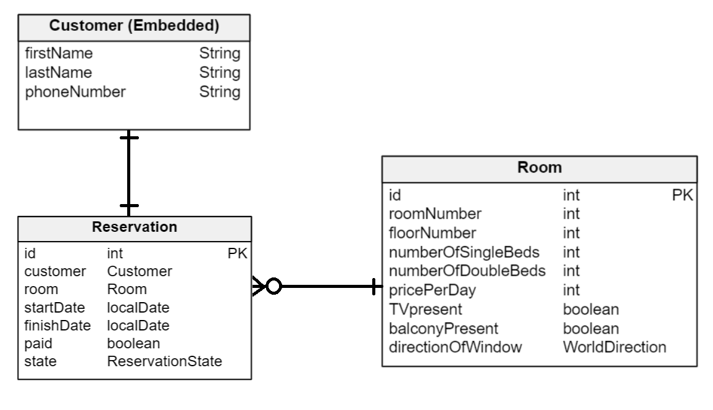
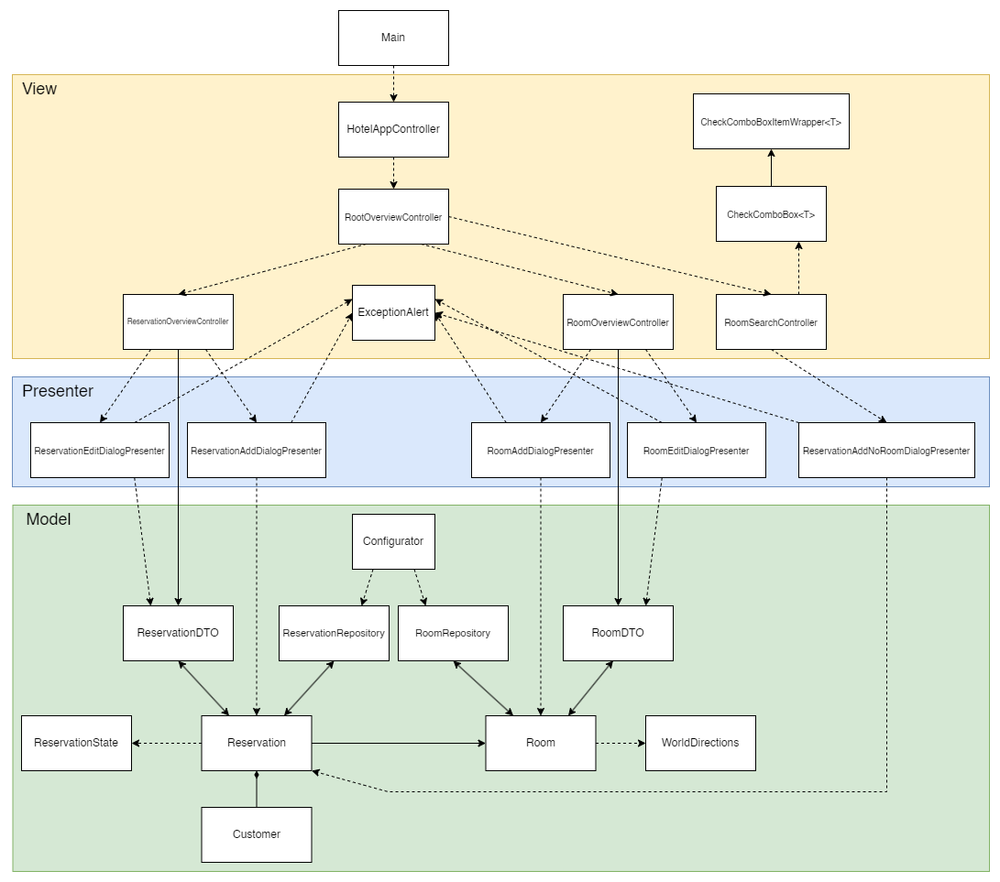

<h1>Aplikacja do hotelowego systemu rezerwacji</h1>

## Charakterystyka problemu
W ramach projektu tworzymy aplikację do zarządzania rezerwacjami pokoi dla pracowników pewnej firmy hotelowej.
Pracownik powinien mieć możliwość:
- edycji informacji o pokojach w hotelu
- wyszukania dostępnego pokoju w wybranym terminie (także z wybranymi kryteriami, np. z daną liczbą łóżek) i utworzenia na niego rezerwacji
- dokonania rezerwacji wybranego pokoju dla klienta w wybranym terminie
- aktualizacji stanu danej rezerwacji
- potwierdzenia zapłaty za rezerwację
- zmiany szczegółów rezerwacji (daty, danych klienta, itp)

## Budowane rozwiązanie problemu
Nasza aplikacja budowana jest w języku Java, przy wykorzystaniu framework'a Spring Boot.
Dodatkowo wykorzystujemy Hibernate do utworzenia bazy danych oraz JavaFX do projektowania widoku naszej aplikacji.

<h3>Funkcjonalność aplikacji:</h3>
W naszej aplikacji użytkownik ma możliwość przełączania się pomiędzy trzema widokami:

- _**Reservations Table**_ - używany do szukania, tworzenia, edytowania oraz usuwania rezerwacji
- _**Rooms Table**_ - używany do szukania, tworzenia, edytowania oraz usuwania informacji o pokojach
- _**Free Room Search**_ - używany do wyszukiwania wolnych pokoi w danym terminie

Każdy z widoków, poza wspomnianymi wyżej funkcjami, posiada również opcję filtrowania wyników według różnych kryteriów, odpowiednich dla danego widoku.
Ponadto dodane zostały również przyciski usprawniające najczęstsze czynności potencjalnych użytkowników aplikacji,
takie jak:
- w widoku **Reservations Table**: potwierdzenie opłacenia rezerwacji oraz zmiana jej statusu na kolejny stan
- w widoku **Free Room Search**: dodanie rezerwacji wybranego wolnego pokoju w zaznaczonym terminie

Aplikacja pilnuje również poprawności danych podczas ich dodawania oraz edytowania przez użytkownika, przy wprowadzeniu niepoprawnych danych wypisuje błąd.

<h3>Baza danych:</h3>
Dane przechowywane są w dwóch tabelach reprezentowanych przez klasy Room i Reservation:

- _**Room**_ — tabela z informacjami o pokojach hotelowych, posiadająca pola:
  - _**roomID**_ - unikalne ID pokoju
  - _**roomNumber**_ - numer pokoju
  - _**floorNumber**_ - numer piętra, na którym znajduje się pokój
  - _**numberOfSingleBeds**_ - liczba pojedynczych łóżek znajdujących się w pokoju
  - _**numberOfDoubleBeds**_ - liczba podwójnych (małżeńskich) łóżek znajdujących się w pokoju
  - _**pricePerDay**_ - cena pokoju za jedną dobę hotelową
  - _**TVpresent**_ - czy pokój posiada telewizor
  - _**balconyPresent**_ - czy pokój posiada balkon
  - _**directionOfWindow**_ - na którą stronę jest widok z okien pokoju

- _**Reservation**_ - tabela z informacjami o rezerwacjach, posiadająca pola:
  - _**reservationID**_ - unikalne ID rezerwacji
  - _**customer**_ - informacje o kliencie dokonującym rezerwacji:
    - _**firstName**_ - imię klienta
    - _**lastName**_ - nazwisko klienta
    - _**phoneNumber**_ - numer telefonu klienta
  - _**room**_ - rezerwowany pokój
  - _**startDate**_ - data początku rezerwacji
  - _**finishDate**_ - data końca rezerwacji
  - _**paid**_ - czy zapłacono za rezerwację
  - _**state**_ - stan rezerwacji

<h3>Diagram bazy danych</h3>

<h3>Diagram klas</h3>

